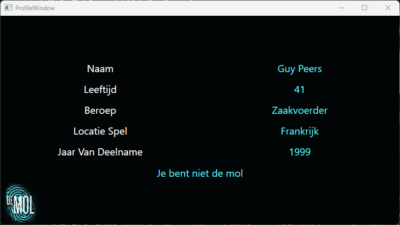
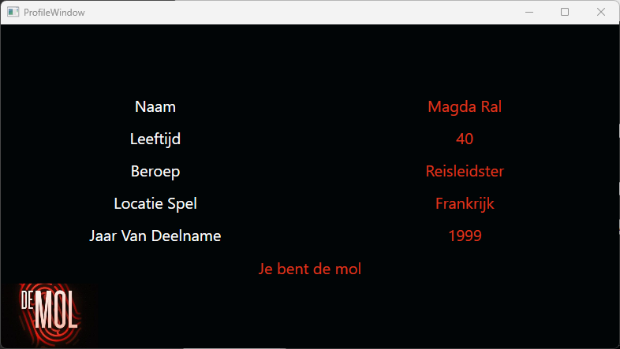

# ADO.NET-connected-4---DeMol

De spelers van De Mol moeten hun status in het spel kunnen opzoeken via een applicatie waarmee ze kunnen achterhalen of ze de mol zijn. Verder kunnen ze in een profielvenster zien wanneer en waar hun spel verloopt.

Er is echter een checkbox voorzien om het gebruik van SqlParameter's aan of uit te vinken. Kan jij als hacker inloggen wanneer de Sql-injectie niet geblokkeerd is?

## Tabellen aanmaken

Gebruik het onderstaande script om de table aan te maken in je eigen database:

> [!IMPORTANT]  
Voer het script uit voor je begint aan de opgave!

<details>

```
-- Als tabel bestaat droppen.
-- Let op de volgorde van het droppen! 
drop table if exists spelers;
drop table if exists spellen;

create table spellen
(spel_id	int			not null primary key
,jaar		int		not null
,locatie	VARCHAR(30)	not null
);

create table spelers
(spelerid					int			not null primary key
,spel_id					int			FOREIGN KEY REFERENCES spellen(spel_id)
,naam						VARCHAR(30)	not null
,wachtwoord					VARCHAR(30) not null
,is_mol						BIT			not null
,leeftijd_tijdens_deelname	int			not null
,beroep						VARCHAR(30) not null
);

insert into spellen values (0, 1999 ,'Frankrijk');
insert into spellen values (1, 2000,'Spanje');
insert into spellen values (2, 2003,'Italië');
insert into spellen values (3, 2015,'Argentië');
insert into spellen values (9, 2020,'Duitsland');

insert into spelers values (0, 0, 'Magda Ral', 'RaldeMag', 1, 40, 'Reisleidster');
insert into spelers values (1, 0, 'Hugo De Bie', 'hug000', 0, 43, 'Personeelschef');
insert into spelers values (2, 0, 'Mon De Ridder', 'r1dm1mon', 0, 60, 'Gepensioneerd leraar');
insert into spelers values (3, 0, 'Guy Peers', 'G00dGuy', 0, 41, 'Zaakvoerder');
insert into spelers values (4, 0, 'Belle Seurs', 'Wachtwoord123', 0, 31, 'Zangeres');
insert into spelers values (5, 0, 'Sylvie De Clercq', 'SuperSylvie', 0, 24, 'Romaniste');
insert into spelers values (6, 0, 'Moniek Van de Velde', 'M0n1ECK', 0, 43, 'Ballonvaarder');
insert into spelers values (7, 0, 'Reggy Samyn', 'GJLlma421', 0, 37, 'Cafébaas');
insert into spelers values (8, 0, 'Anke Van Berendoncks', 'qd68wùé3', 0, 22, 'Fotograaf');
insert into spelers values (9, 0, 'Dimi Claeys', 'jkecvzs!!!', 0, 24, 'Creatief therapeut');

insert into spelers values (10, 1, 'Hugo Daemen', 'NotMol!', 1, 67, 'Gepensioneerd kolonel');
insert into spelers values (11, 1, 'Marianne Dupon', 'BornToWin', 0, 28, 'Crisismanager');
insert into spelers values (12, 1, 'Niki De Boeck', 'toeasy', 0, 49, 'Kinesiste');
insert into spelers values (13, 1, 'Carine Leroy', 'helderdenken', 0, 33, 'Bediende');
insert into spelers values (14, 1, 'David Devogele', 'IhaveADream', 0, 24, 'Student marketing');
insert into spelers values (15, 1, 'Eef Mahauden', 'QSfsmiamknw', 0, 20, 'Studente archeologie');
insert into spelers values (16, 1, 'Dominiek Roosen', 'R35DS6?5M34', 0, 30, 'Opvoeder');
insert into spelers values (17, 1, 'Luc Schelfaut', '16q313XXXfg', 0, 51, 'Chauffeur');
insert into spelers values (18, 1, 'Marie-Rose Mels', 'PXM5?33µmlm', 0, 45, 'Zelfstandige');
insert into spelers values (19, 1, 'Bart Debbaut', '6549873156987', 0, 28, 'Adjunct-bankdirecteur');

insert into spelers values (20, 2, 'Marc Simons', 'NotMol!', 1, 45, 'Verzekeraar');
insert into spelers values (21, 2, 'Stijn Vandaele', '3vqDdv69ZCCw5qR6', 0, 22, 'Student sinologie');
insert into spelers values (22, 2, 'Sandra Welvaert', 'XNgkcm6BWPywE6B4', 0, 30, 'Gerante kledingzaak');
insert into spelers values (23, 2, 'Inge Boere', 'sbf46brv4beeSdTq', 0, 35, 'Dierenarts');
insert into spelers values (24, 2, 'Shadia Bellafkih', 'xGDczqTkrjAzRPMc', 0, 25, 'IT-specialist');
insert into spelers values (25, 2, 'Corry Deltour', 'W3CBdxWapWAxtd8W', 0, 39, 'Bediende');
insert into spelers values (26, 2, 'Walter Sap', 'HgRuxcuLKGAPpErr', 0, 50, 'Postbode');
insert into spelers values (27, 2, 'Bruno De Roover', 'PxKrRmvXASPuwRXG', 0, 30, 'Striptekenaar');
insert into spelers values (28, 2, 'Nicole Van Herck', 'Hvd7M3F7AEUrrTxf', 0, 41, 'Bediende');
insert into spelers values (29, 2, 'Christophe Grosjean', 'ARqScaBHd36uGd2S', 0, 34, 'Manager');

insert into spelers values (30, 9, 'Annelotte De Brandt', 'AKDdzk3mC66Z2mb2', 1, 25, 'Recruiter');
insert into spelers values (31, 9, 'Lennart Driesen', 'rrEM9xt3Z74ZUrrz', 0, 25, 'Opvoeder');
insert into spelers values (32, 9, 'Sven Uyttersprot', 'GAgS5mPQBQA5bQPz', 0, 41, 'Horeca-uitbater');
insert into spelers values (33, 9, 'Philip De Cleen', 'gCMPpvVSbggG3wnC', 0, 51, 'Docent marketing');
insert into spelers values (34, 9, 'Jasmien Foré', 'FKK6R2Fv39sbzqsb', 0, 30, 'Advocate');
insert into spelers values (35, 9, 'Samina Carremans', 'd6w8rfSaq2YuAsJJ', 0, 42, 'Flamencolerares');
insert into spelers values (36, 9, 'Katrien Cuppens', '5hLZ4Gpbe2XZJDwG', 0, 39, 'Vaatchirurg');
insert into spelers values (37, 9, 'Noah Vlieghe', 'y62srZqk4s3BsW4k', 0, 18, 'Student orthopedagogie');
insert into spelers values (38, 9, 'Kevin Cuykens', 'eankrbWRE4qwaUCJ', 0, 30, 'Jurist');
insert into spelers values (39, 9, 'Dami Oguntubi', '8xs9RVhvY8k36rZg', 0, 20, 'Studente psychologie');
insert into spelers values (40, 9, 'Jens Zutterman', '5hLZ4Gpbe2XZJDwG', 0, 30, 'Schrijnwerker');

```
</details>

## Views

MainWindow


ProfileWindow voor een speler



ProfileWindow voor een mol



## Code

1. Als speler kan ik de invoervelden voor naam en wachtwoord gebruiken om me in te loggen. Indien er één of meer regels in de database zitten die dezelfde naam en hetzelfde wachtwoord hebben, dan wordt de gebruiker van de eerst gevonden rij ingelogd.
2. Als een speler wordt ingelogd, dan wordt het profielvenster getoond met de informatie van de ingelogde speler.
3. Afhankelijk van de status van de speler wordt de tekst in de respectievelijke kleur getoond in het profielvenster.
	```
	// De mol kleur      : #e0371d
	// De niet mol kleur : #61f1f1
	```

4. Afhankelijk van de status van de ingelogde speler wordt de afbeelding aangepast:
    * De mol ziet de afbeelding: “DeMolRed.jpg”
    * De niet-mollen zien de afbeelding: “DeMol.jpg”
5. Als gebruiker kan ik de checkbox SQL injectie activeren.
    * Zolang de checkbox niet is aangevinkt, maakt het programma achterliggend gebruik van SqlParameter’s om de naam en wachtwoord van een speler door te geven aan het SqlCommand.
    * Zolang de checkbox is aangevinkt, maakt het programma achterliggend gebruik van string interpolatie om de naam en wachtwoord van een speler door te geven aan het SqlCommand.

> [!TIP]
> Nog enkele tips:
1. *Maak gebruik van een methode ZetKleur(Color kleur) die de tekst in het profielvenster van kleur verandert.*
2. *Maak gebruik van een methode GetSpel die het spel van de speler ophaalt uit de database.*
3. *Het aanpassen van een imagesource doe je mbv een BitmapImage en een Uri.*
4. *Maak gebruik van Entities, zoals Speler en Spel classes, zodat je makkelijker data kan doorgeven doorheen de WPF applicatie.*
